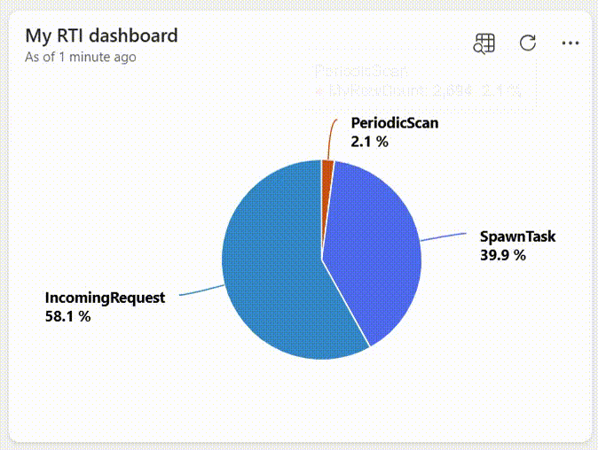

# The Investment Project
This solution performs data analysis on the provided information by using Real-Time Intelligence on Microsoft Fabric, in addition to integrating data from various sources, while making real-time decisions a reality.  
**This project is part of my Fabric and AI Hackathon that can be found here:*
&nbsp;
&nbsp;
&nbsp;  
 

## Inspiration
I drew inspiration for this project/solution from real problems in the banking sector (e.g. Corporate & Investment banking), and from my latest applied skills.  
 

## How to Build/Test
By using Microsoft Fabric Real-Time Intelligence workspace, a solution/workload that's completely capable of streaming data to Fabric, driving decisions in real-time, etc.  

Here is how you can make it work/test it:  
**1.1)** Start by uploading the *MyImportData.csv* data into a KQL-database.

**1.2)** During this process, create the following table/schema for the aforementioned data:
| Column Name   *(suggestion)* | Data Type   *(header excluded)* |
| :---------  | :--------- |
| MyTimestamp | DateTime |
| MyMachine   | String |
| MyEventType | String |
| MyMessage   | String |

And here is how it should look like right before finishing:  

**2.0)** Then, analyse the imported data with a grouped rowcount. More precisely, with an overview for each Event Type as follows:  
  
**Obs.:** This dashboard and its associated KQL-queryset are inside the folders *MyRTIdashboard.KQLDashboard*, and *MyImport.KQLQueryset* respectively.

 

## What it does
- Performs data analysis of the information into Fabric Real-Time Intelligence;  
- Integrates data from various sources;  
- All of this while making real-time decisions a reality`¹`.

`¹Based on the integrated data`  
 

## Challenges I ran into
The transformation/real-time data processing, directly before the streaming data routing.  
 

## What I learned
How to perform a deep analysis with KQL (Kusto Query Language), an effective tool to explore data, identify anomalies, discover patterns and more.