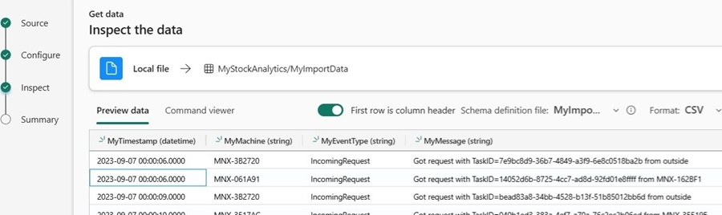
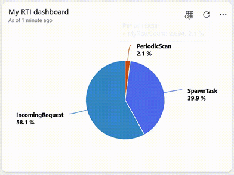

# The Investment Project
This solution performs data analysis on the provided information by using Real-Time Intelligence on Microsoft Fabric, in addition to integrating data from various sources, while making real-time decisions a reality.  
<br>
**This project is part of my Fabric and AI Hackathon that can be found here:*  
&nbsp;[](https://devpost.com/software/the-investment-project)
&nbsp;&nbsp;&nbsp;&nbsp;&nbsp;&nbsp;&nbsp;[](https://developer.microsoft.com/en-us/)
&nbsp;&nbsp;&nbsp;&nbsp;&nbsp;&nbsp;&nbsp;[](https://www.microsoft.com/en-us/microsoft-fabric)  
&nbsp;[](https://youtu.be/NV-PGdXJI9o)  
<br>

## Inspiration
I drew inspiration for this project/solution from real problems in the banking sector (e.g. Corporate & Investment banking), and from my latest applied skills.  
<br>

## How to Build/Test
By using the Microsoft Fabric Real-Time Intelligence workspace, a solution/workload that's completely capable of streaming data to Fabric, driving decisions in real-time, etc.  

Here is how you can make it work/test it:  
**1.1)** Start by uploading the *MyImportData.csv* data into a KQL-database.

**1.2)** During this process, create the following table/schema for the aforementioned data:
| Column Name <br> *(suggestion)* | Data Type <br> *(header excluded)* |
| :---------  | :--------- |
| MyTimestamp | DateTime |
| MyMachine   | String |
| MyEventType | String |
| MyMessage   | String |

And here is how it should look like right before finishing:  
  
<br>

**2.0)** Then, analyze the imported data with a grouped rowcount. More precisely, with an overview for each Event Type as follows:   
  
**Obs.:** This dashboard and its associated KQL-queryset are inside the folders *MyRTIdashboard.KQLDashboard*, and *MyImport.KQLQueryset* respectively.  
<br>

**3.0)** As the work continues on the investment project, another analysis in real-time should be carried out, this time even more complex as shown below.
```kql
//KQL-queryset (which creates a calculated column) enhanced by Copilot
MyImportData 
| project MyEventType, MyMachine, MyTimestamp
| where MyEventType in ("IncomingRequest", "PeriodicScan")
| take 10000
| extend MyNumberOfMinutesSince = datetime_diff('minute', now(), MyTimestamp)
```  
<br>

**4.0)** Now, it's time to process/transform streaming data, so you can make real-time decisions a reality.  
 &nbsp;&nbsp;&nbsp;**a)** Configure the Stock-Market dataset (which gives this Project's name) as the streaming source;  
 <br>
 &nbsp;&nbsp;&nbsp;**b)** After the transformations below, route this streaming data into the same KQL-database, thus integrating data from multiple sources.  
&nbsp;&nbsp;&nbsp;  
<br>

## What it does
- Performs data analysis of the information into Fabric Real-Time Intelligence;  
- Integrates data from various sources;  
- All of this while making real-time decisions a reality`¹`.

`¹Based on the integrated data`
<br>
<br>

## Challenges I ran into
The transformation/real-time data processing, directly before the streaming data routing.
<br>
<br>

## What I learned
How to perform a deep analysis with KQL (Kusto Query Language), an effective tool to explore data, identify anomalies, discover patterns and more.
